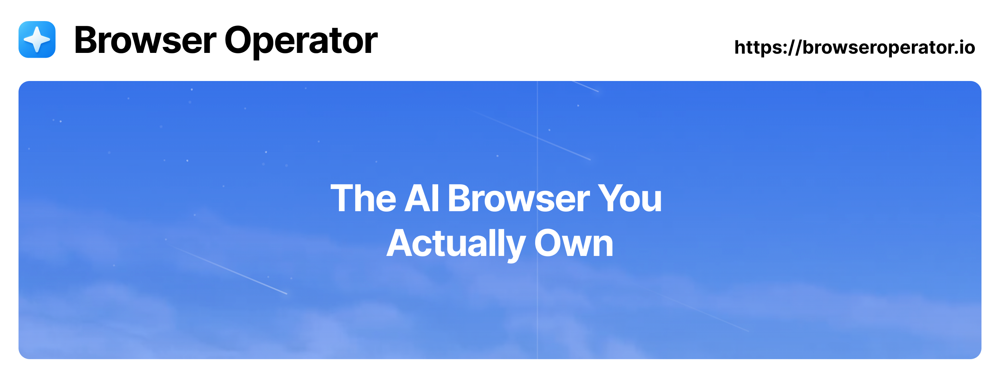

# Browser Operator AI Agent SDK

<div align="center">



**Open-source, production-ready AI agent framework for TypeScript/JavaScript**

[](../LICENSE)
[](https://www.npmjs.com/package/@browser-operator/sdk)
[](https://www.typescriptlang.org/)

[Documentation](https://docs.browseroperator.io/sdk) • [Examples](./examples) • [API Reference](https://docs.browseroperator.io/sdk/api)

</div>

---

## 🚀 Quick Start

```bash
# Create a new agent project
npm create @browser-operator/agent

# Or install the SDK directly
npm install @browser-operator/sdk ai zod
```

```typescript
import { Agent } from '@browser-operator/sdk';
import { openai } from 'ai';

const agent = new Agent({
  name: 'my-agent',
  instructions: 'You are a helpful assistant',
  model: openai('gpt-4'),
  tools: [searchTool, extractTool],
});

const result = await agent.generateText('Hello!');
console.log(result.text);
```

## ✨ Features

- 🤖 **Multi-Agent Systems** - Coordinate multiple specialized agents
- 🔧 **Extensible Tools** - Build custom tools with Zod schemas
- 🔄 **Workflow Engine** - State graphs and chainable workflows with suspend/resume
- 💾 **Memory Management** - Conversation, semantic, and working memory
- 🛡️ **Guardrails** - Built-in safety for production use
- 📊 **Observability** - OpenTelemetry and Langfuse integration
- 🌐 **Platform Agnostic** - Works in browser, Node.js, and edge runtimes
- 🔌 **40+ LLM Providers** - Powered by Vercel AI SDK
- 🧪 **Fully Tested** - >80% test coverage with mock utilities

## 📦 Packages

| Package | Description | Version |
|---------|-------------|---------|
| [@browser-operator/sdk](./packages/sdk) | Main SDK (aggregates all packages) | - |
| [@browser-operator/core](./packages/core) | Core agent framework | - |
| [@browser-operator/llm](./packages/llm) | LLM integration layer | - |
| [@browser-operator/tools](./packages/tools) | Tool system | - |
| [@browser-operator/workflows](./packages/workflows) | Workflow engine | - |
| [@browser-operator/memory](./packages/memory) | Memory management | - |
| [@browser-operator/observability](./packages/observability) | Tracing & monitoring | - |
| [@browser-operator/guardrails](./packages/guardrails) | Safety guardrails | - |

## 🏗️ Architecture

The SDK is built on modern, production-ready foundations:

- **Vercel AI SDK v5** - Universal LLM interface
- **OpenTelemetry** - Industry-standard observability
- **Zod** - Runtime type validation
- **XState** - Robust state machines
- **TypeScript** - Full type safety

## 📚 Documentation

- [Getting Started](../docs/SDK_EXTRACTION_PLAN.md)
- [Core Concepts](./docs/core-concepts.md)
- [API Reference](./docs/api-reference.md)
- [Examples](./examples)

## 🎯 Use Cases

- **Research & Analysis** - Automated information gathering and analysis
- **Browser Automation** - Intelligent web interaction and data extraction
- **Content Generation** - AI-powered writing and content creation
- **Multi-Agent Systems** - Coordinated agent workflows
- **Human-in-the-Loop** - Workflows with approval steps

## 🛠️ Development

```bash
# Install dependencies
pnpm install

# Build all packages
pnpm build

# Run tests
pnpm test

# Development mode
pnpm dev
```

## 📄 License

BSD-3-Clause - see [LICENSE](../LICENSE) for details

## 🤝 Contributing

We welcome contributions! See our [Contributing Guide](../CONTRIBUTING.md) for details.

---

<div align="center">

**Built with ❤️ by the Browser Operator team**

[Website](https://browseroperator.io) • [Discord](https://discord.gg/fp7ryHYBSY) • [GitHub](https://github.com/BrowserOperator/browser-operator-core)

</div>
